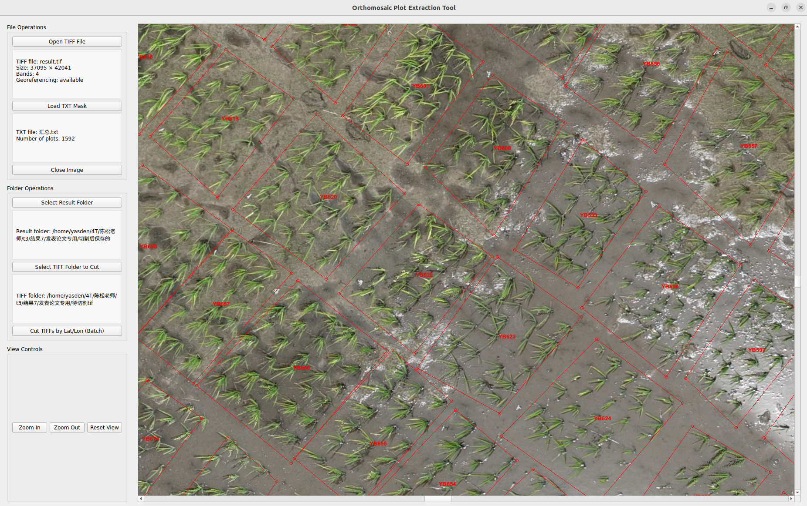

# Orthomosaic Plot Extraction Tool (OPET)

Extract plot‑level pseudo‑RGB patches from georeferenced orthomosaic TIFFs using GPS corner coordinates.

## 软件截图

## 📖  Introduction

In UAV‑based agricultural research, orthomosaics (stitched images) are widely used as a base for extracting plot‑level data. However, annotating hundreds of plots directly on raw aerial images is impractical. Orthomosaics provide a single, standardised top‑down view that makes manual plot annotation feasible.

OPET is a desktop tool that automates the extraction of plot images from a georeferenced orthomosaic (GeoTIFF). Given a text file containing the GPS corner points of each plot, OPET:

    Reads the orthomosaic and preserves its geographic reference.

    Orders the corners into a convex hull polygon.

    Crops the polygon region from the orthomosaic and saves it as a separate GeoTIFF with the same projection.

This enables researchers to:

    Re‑use the same corner file for multiple orthomosaics (e.g., different flight dates or stitching outputs).

    Batch‑process a whole folder of GeoTIFFs in one go.

The output patches serve as reference images for subsequent analysis, such as comparison with raw aerial imagery or further machine‑learning pipelines.

## 🚀 Features

    GeoTIFF support – reads and preserves geographic reference (projection & geo‑transform) using GDAL.

    TXT mask loading – each line: plot_name lon1 lat1 lon2 lat2 ... (WGS84, at least 3 corners).
    Polygons are automatically ordered via convex hull (using scipy.spatial if available, else a fallback).

    Interactive preview – view the orthomosaic with plot polygons overlaid; zoom, pan, and reset view.

    Batch cutting – select a folder containing multiple GeoTIFFs; OPET cuts every plot from every TIFF and saves them in sub‑folders named after each TIFF file.

    Output – each plot is saved as a GeoTIFF with the original projection, background filled with white (or appropriate background value for non‑byte data).

## 📦  Dependencies

    Python 3.7+

    GDAL (with Python bindings) – required

    PyQt5 – for the GUI

    NumPy

    scikit‑image – optional (for polygon mask; falls back to full‑rectangle if absent)

    scipy – optional (for convex hull; falls back to a custom implementation)
    

Install them via pip:

bash

pip install numpy PyQt5 gdal scikit-image scipy

    Note: Installing GDAL can be tricky on some systems. We recommend using conda (conda install gdal) or following the official GDAL installation guide.
    

## 🖥️ Usage

1. Launch the application
bash

python a109-orthomosaic-plot-extraction-tool.py

2. Load a TIFF orthomosaic

    Click “Open TIFF File” and select your georeferenced orthomosaic (e.g., orthomosaic.tif).
   
    The tool will display the image and show its size, band count, and georeferencing status.

3. Load the TXT mask file

    Click “Load TXT Mask” and choose your corner file.
    The polygons will be drawn on the image (red borders with plot names).

4. Set output and input folders

    “Select Result Folder” – choose where to save the cropped patches.

    “Select TIFF Folder to Cut” – choose the folder containing the TIFF(s) you want to process (can be the same as the loaded TIFF or a different one).

5. Run batch cutting

    Click “Cut TIFFs by Lat/Lon (Batch)”.
    For every TIFF in the selected folder, OPET will:
   
        Create a sub‑folder named after the TIFF file (e.g., orthomosaic/).

        For each plot, crop the polygon and save it as {tiff_name}_{plot_name}.tif.

6. View controls

    Zoom In / Zoom Out – adjust the view.

    Reset View – return to the initial zoom level.
   

## 📂  Input File Formats

TXT mask file (corner file)

    Encoding: UTF‑8 (or ASCII)

    Format:
    text

    plot_name lon1 lat1 lon2 lat2 lon3 lat3 ...

        plot_name – any string (no spaces)

        Coordinates are in WGS84 (decimal degrees)

        At least 3 corners are required; the polygon is automatically convex‑hull‑ordered.

    Example:
    text

    DA3 121.123456 30.123456 121.123457 30.123457 121.123458 30.123455
    
    DA4 121.123459 30.123459 121.123460 30.123460 121.123461 30.123458 121.123462 30.123457

GeoTIFF requirements

    Must contain a valid GeoTransform and Projection (i.e., georeferenced).

    Any number of bands is supported; the crop will preserve all bands.

    For single‑band images, a grayscale colormap is used for display; for multi‑band (≥3), the first three bands are shown as RGB.
    

## 📤  Output

    Each cropped plot is saved as a GeoTIFF with the same projection and pixel type as the source.

    The background (outside the polygon) is filled with white for 8‑bit images, or 0 for other data types (e.g., 16‑bit).

    File naming: {source_tiff_base}_{plot_name}.tif

    All outputs for a given TIFF are stored in a sub‑folder named after the TIFF file inside your chosen result folder.
    

## 🧪 Example Workflow

    Annotate your field plots on the orthomosaic using a polygon‑drawing tool (e.g., our companion Community Annotation Software) and save the corner file (plots.txt).

    Open OPET and load the same orthomosaic.

    Load plots.txt to preview the polygons.

    Select the folder containing your orthomosaic(s) (e.g., ./orthomosaics/) and a result folder (./cropped_plots/).

    Run batch cutting – OPET will generate all plot images.

    These plot images are now ready for further analysis (e.g., vegetation index calculation, deep learning classification, or comparison with raw aerial data).
    

## 📜  Citation

If you use OPET in your research, please cite this software as:

    Orthomosaic Plot Extraction Tool (OPET) – https://github.com/zyxyes1/Orthomosaic-Plot-Extraction-Tool
    

## 🤝  Contributing

We welcome issues, feature requests, and pull requests. Please open an issue first to discuss major changes.

## 📧  Contact

For questions or collaboration, please contact the authors via the GitHub repository.
